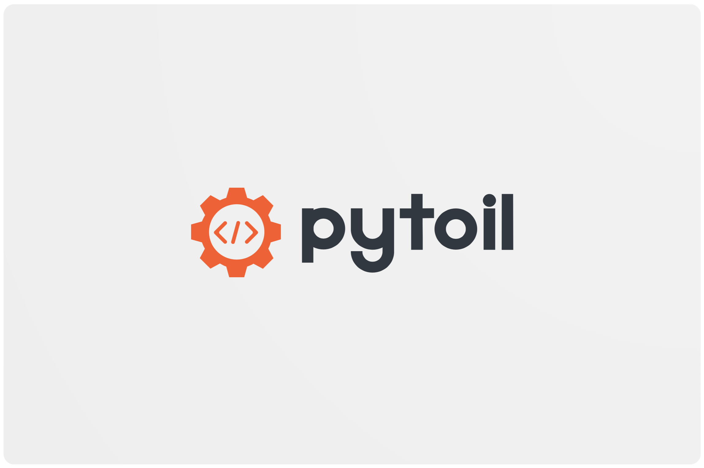

[](https://github.com/FollowTheProcess/pytoil)
[](https://pypi.python.org/pypi/pytoil)
[](https://github.com/FollowTheProcess/pytoil)
[](https://github.com/FollowTheProcess/pytoil/actions?query=workflow%3ACI)
[](https://github.com/FollowTheProcess/pytoil)

*pytoil is a small, helpful CLI to help developers manage their local and remote projects with ease!*

* **Source Code**: [https://github.com/FollowTheProcess/pytoil](https://github.com/FollowTheProcess/pytoil)

* **Documentation**: [https://FollowTheProcess.github.io/pytoil/](https://FollowTheProcess.github.io/pytoil/)

## What is it?

`pytoil` is a handy tool that helps you stay on top of all your projects, remote or local. It's primarily aimed at python developers but you could easily use it to manage any project!

pytoil is:

* Easy to use :white_check_mark:
* Easy to configure :white_check_mark:
* Safe (it won't edit your repos at all) :white_check_mark:
* Useful! (I hope :smiley:)

Say goodbye to janky bash scripts :wave:

## Background

Like many developers I suspect, I quickly became bored of typing repeated commands to manage my projects, create virtual environments, install packages, fire off `cURL` snippets to check if I had a certain repo etc.

So I wrote some shell functions to do some of this for me...

And these shell functions grew and grew and grew.

Until one day I saw that the file I kept these functions in was over 1000 lines of bash (a lot of `printf`'s so it wasn't all logic but still). And 1000 lines of bash is *waaaay* too much!

And because I'd basically hacked it all together, it was **very** fragile. If a part of a function failed, it would just carry on and wreak havoc! I'd have to do `rm -rf all_my_projects`... I mean careful forensic investigation to fix it.

So I decided to make a robust CLI with the proper error handling and testability of python, and here it is! :tada:

## Installation

As pytoil is a CLI program, I'd recommend installing with [pipx]

<div class="termy">

```console
$ pipx install pytoil
---> 100%
Successfully installed pytoil
```

</div>

If you don't know what pipx is, go check it out! But basically it allows python CLI tools to be installed in their own sandboxed environments but you can still access the CLI as if it was installed globally!

You can always fall back to pip

<div class="termy">

```console
$ python3 -m pip install pytoil
---> 100%
Successfully installed pytoil
```

</div>

!!! warning

    keep in mind though, you'll have to install it globally for it to work so it might be better to use pipx

pytoil will install everything it needs *in python* to work. However, it's full feature set can only be accessed if you have the following external dependencies:

* [git]
* [conda] (if you work with conda environments)
* [VSCode] (if you want to use pytoil to automatically open your projects for you)

## Quickstart

`pytoil` is super easy to get started with.

After installation just run

<div class="termy">

```console
$ pytoil init

# GitHub username:$ YourGitHubUsername
# GitHub personal access token:$ YourTokenHere
# Absolute path to your projects directory:$ /Users/you/projects
# Use VSCode to open projects?:$ True
```

</div>

This will create a config file which can be found at `~/.pytoil.yml`, and will walk you through setting the tool up.

Don't worry though, there's only a few options to configure! :sleeping:

After that you're good to go! You can do things like:

#### See your local and remote projects

<div class="termy">

```console
$ pytoil show all

Local Projects:

- Project1
- Project2
- Project3

Remote Projects:

- Remote1
- Remote2
- etc..
```

</div>

#### See which ones you have on GitHub, but not on your computer

<div class="termy">

```console
$ pytoil show diff

Remote projects that are not local:

- Projectyoudonthave1
- Projectyoudonthave2
```

</div>

#### Easily grab a project, regardless of where it is

<div class="termy">

```console
$ pytoil checkout myproject

Resuming 'myproject'...

// Will now either open that project if local
// or clone it if not
// Ensure virtual environments are set up etc.
```

</div>

#### Create a new project and virtual environment in one go

<div class="termy">

```console
$ pytoil create myproject --venv virtualenv

Creating project: 'myproject' at '/Users/you/projects/myproject'

Creating virtualenv for: 'myproject'
```

</div>

#### And even do this from a [cookiecutter] template

<div class="termy">

```console
$ pytoil create myproject --venv virtualenv --cookie https://github.com/some/cookie.git

Creating project: 'myproject' with cookiecutter template: 'https://github.com/some/cookie.git'

// You'll then be asked all the cookiecutter questions defined in the template
// After which pytoil will take over and create the virtual environment as normal
```

</div>

[pipx]: https://pipxproject.github.io/pipx/
[cookiecutter]: https://cookiecutter.readthedocs.io/en/1.7.2/

### Help

Like all good CLI programs, pytoil (aswell as all it's subcommands, and all *their* subcommands!) has a `--help` option to show you what to do.

<div class="termy">

```console
$ pytoil --help

Usage: pytoil [OPTIONS] COMMAND [ARGS]...

  Helpful CLI to automate the development workflow.

  - Create and manage your local and remote projects

  - Build projects from cookiecutter templates.

  - Easily create/manage virtual environments.

  - Minimal configuration required.

Options:
  -V, --version         Display pytoil version.
  --install-completion  Install completion for the current shell.
  --show-completion     Show completion for the current shell, to copy it or
                        customize the installation.

  --help                Show this message and exit.

Commands:
  checkout  Checkout a development project, either locally or from GitHub.
  config    Interact with pytoil's configuration.
  create    Create a new development project locally.
  info      Show useful information about a project.
  init      Initialise pytoil.
  remove    Deletes a project from your local filesystem.
  show      View your local/remote projects.
  sync      Synchronise your local and remote projects.
```

</div>

!!! info
    
    pytoil's CLI is designed such that if you don't specify any arguments, it won't do anything! just show you the `--help`. This is called being a 'well behaved' unix command line tool.

    This is true for any subcommand of pytoil so you won't accidently break anything if you don't specify arguments :tada:.

[git]: https://git-scm.com
[conda]: https://docs.conda.io/en/latest/
[VSCode]: https://code.visualstudio.com
